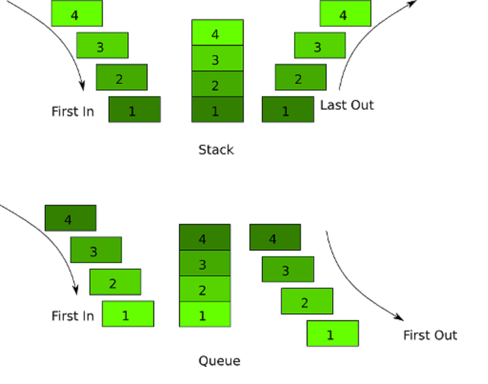

# Stacks and Queues

## Stack


*Imagine that you have a stack of dinner plates to wash after you have dined with your family, and you are responsible to wash this stack of plates. You can argue that sometimes you can remove an element from the middle of the stack without actually removing the plate from the top, and that’s a valid argument. Imagine that in some situations we only have the option to remove the most recent element added to the stack. A stack data structure follows the same principle and it’s called a LIFO data structure.*

*A stack is a linear data structure, which means that all elements are arranged in sequential order. Sometimes there can be more than two operations in a stack data structure. Sometimes we might use the isEmpty operation to check if the stack is empty, and the peek operation to return the top element without modifying the stack. Now that we know about how the stack data structure works, let’s start the implementation in JavaScript.*


```

//creates a node class that will represent elements/nodes in the stack
class Node {
  constructor (value) {
    this.value = value;
    this.next = next;
  }
}
//creates a Stack class that will store elements/nodes
class Stack {
  constructor () {
    this.first = null;
    this.last = null;
    this.size = 0;
  }
//when we want to add a node to the stack we call the push method on the stack and pass the value as an argument
push (value) {
    let node = new Node(value);
    if (this.size === 0) {
      this.first = node;
      this.last = node;
    } else if (this.size >= 1) {
      let currFirst = this.first;
      this.first = node;
      this.first.next = currFirst;
    }
    return this.size++;
  }
//when we want to remove the last node off the stack we call the pop method
pop () {
    if (this.size === 0) {
      return null;
    }
    let temp = this.first;
    if (this.size === 1) {
      this.last = null;
    }
    this.first = this.first.next;
    this.size --;
    return this.first;
  }
}

```

## Queue


*A queue is a linear structure of sequential and ordered elements, similar to a stack, with a difference that it works based on the principle of first in first out . Similar to a stack, we have a linear data structure, which means that all the operations in a queue can only happen at one end of the structure, in this case, the beginning of the queue. JavaScript is a very helpful and handy language that provides us a lot of different methods to help us to achieve better results. The nice thing about JavaScript is that we also have a method to remove the first element of an array, which is the shift array method.*


```

//create a Node class that will represent elements/nodes in the Queue
 class Node {
   constructor (value) {
     this.value = value;
     this.next = null;
   }
 }
//creates a Queue class to store the elements/nodes of the Queue
 class Queue {
   constructor () {
     this.first = null;
     this.last = null;
     this.size = 0;
   }
   //enqueues a node
   enqueue(val) {
     let node = new Node(val);
     if (this.size === 0) {
       this.first = node;
       this.last = node;
     } else {
       this.last.next = node;
       this.last = node;
     }
     return this.size++;
   }
  //dequeues a node 
  dequeue () {
    if (!this.first) {
      return null;
    }
    let temp = this.first;
    if (this.first === this.last){
      this.last = null;
    }
    this.first = this.first.next;
    this.size--;
    return temp.value;
  }
 }


 ```


## Conclusion

**In conclusion, Stacks and Queues are actually quite similar and relatively easy to build and use in Javascript. Arrays can be used to mimic the functionality of both Stacks and Queues. However, if you are looking for a leaner more specific way to build Stacks and Queues you can implement them yourself using Javascript Class syntax in your code. The key thing to remember is that a Stack is Last In First Out (LIFO), and a Queue is First In First Out (FIFO).**



