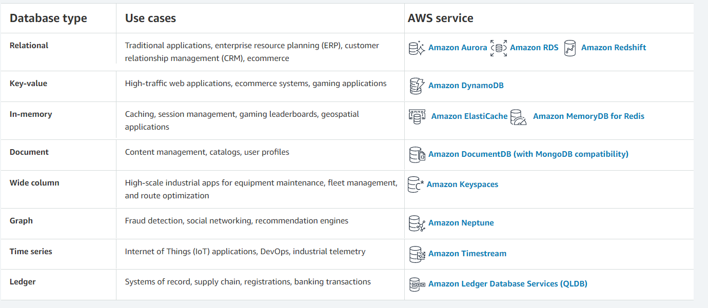

# AWS: Events

## Review, Research, and Discussion


- Describe the similarities between AWS API Gateway + Lambda functions and an ExpressJS Server

```

They are both ways you can implement an API. Within an Express Server you define your routes and write the logic for them. With AWS API Gateway, you set up your routes and then implement the functionality using lamda functions.


```


- List the AWS Database offerings and talk about the pros and cons of each





- What’s the difference between a FIFO and a standard queue?

```

Standard queues provide at-least-once delivery, which means that each message is delivered at least once. FIFO queues provide exactly-once processing, which means that each message is delivered once and remains available until a consumer processes it and deletes it.

```


- How can the server be assured a message was properly received?

```

Logging and using timestamps and checking whether it was delivered based on the response sent from the endpoint.

```


## Document the following Vocabulary Terms


**Term** | **Def**
------------ | -------------
 Serverless API |  A server is created. The server then converts the dictionary to a standard Python WSGI and feeds it into the application. The application returns it, and it passess it through the API Gateway.
 Triggers | a Lambda resource or a resource in another service that you configure to invoke your function in response to lifecycle events, external requests, or on a schedule. Your function can have multiple triggers. Each trigger acts as a client invoking your function independently.
 Dynamo vs Mongo | MongoDB is one of the most famous documents oriented database whereas DynamoDB is scalable, hosted NoSQL database service provided by Amazon with the facility to store the data in Amazon's cloud. Mongo database offers some API for user-defined Map/Reduce methods, whereas Map Reduce is not supported in Dynamo database.
 Dynamoose vs Mongoose | Both these databases support multi-document transactions, but with key differences: MongoDB supports read and writes to the same documents and fields in a single database transaction. DynamoDB lacks support for multiple operations within a single transaction.


## Preview

Which 3 things had you heard about previously and now have better clarity on?
> Dynamoose ,Triggers,Serverless

Which 3 things are you hoping to learn more about in the upcoming lecture/demo?
> Dynamoose ,Triggers,Serverless

What are you most excited about trying to implement or see how it works?
> Dynamoose ,Triggers,Serverless

